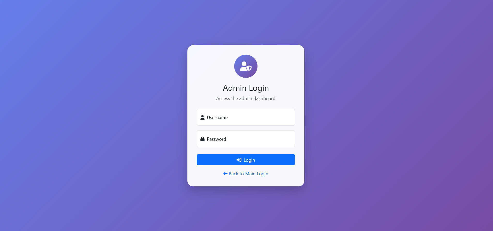
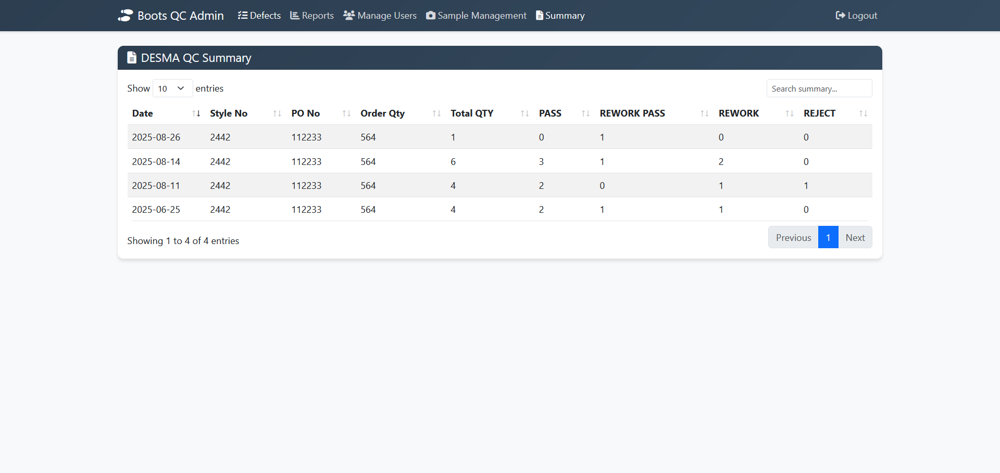
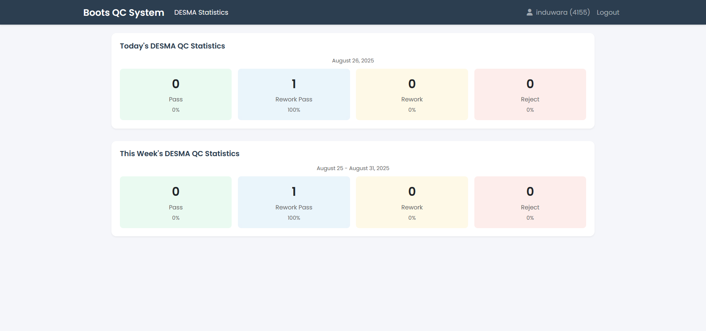
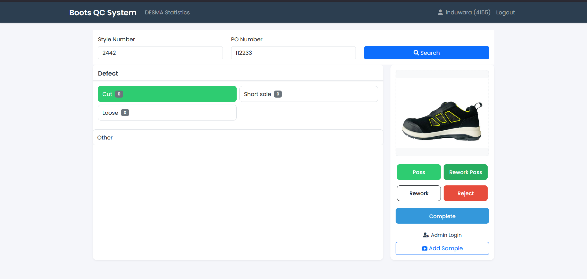
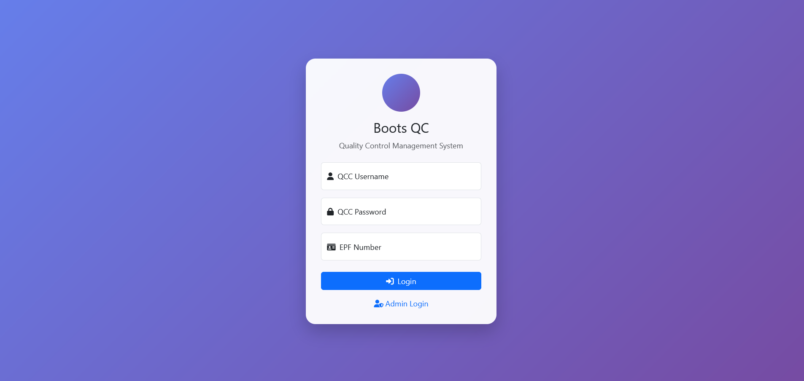

# 🥾 Boot Quality Check System

A modern **Laravel + MySQL** web app that digitizes the quality-check workflow in a **safety boot manufacturing** environment.  
It replaces paper/Excel forms with a clean interface for operators and supervisors—faster, searchable, and report-ready.

---

## ✨ Features

### 👷 Operators (Quality Checkers)
- Secure login with username + password
- Search by **Model No.** and **PO Number**
- Record inspection result:
  - ✅ **Approved**
  - 🔄 **Remake**
  - ❌ **Reject**
- Attach photos of damaged parts (evidence & traceability)

### 🛠️ Supervisors (Admins)
- Manage **Products**, **Defects**, and **Checkers**
- Generate **automatic Excel reports** (with charts)
- View quick **summaries** (daily/weekly/monthly)

---

## 📊 Reports
- **Excel** exports with:
  - All inspection details
  - Aggregations & summaries
  - **Graphs** for trends / defects / pass-rates

---

## 🧱 Tech Stack
- **Backend**: Laravel (PHP 8+)
- **Database**: MySQL
- **Views**: Blade / HTML / CSS / Bootstrap
- **Hosting**: InfinityFree

---

## 👤 User Roles
- **Operators** → Perform checks & upload defect photos  
- **Admins (Supervisors)** → Manage entities, generate reports, monitor quality

---

## 📷 Screenshots

  
  
  
   
   
   

**Videos** → `assets/videos/`  
## 🎥 Demo Video

<video src="assets/videos/demo.mp4" width="720" autoplay muted loop playsinline></video>

---

## 📌 Project Status
Personal **portfolio project** to showcase skills in Laravel + MySQL + reporting.

---

## ✍️ Author
**Induwara Dissanayake**  
Email: sahasrainduwara35@gmail.com  
Portfolio: https://portfolio-induwara.vercel.app/
